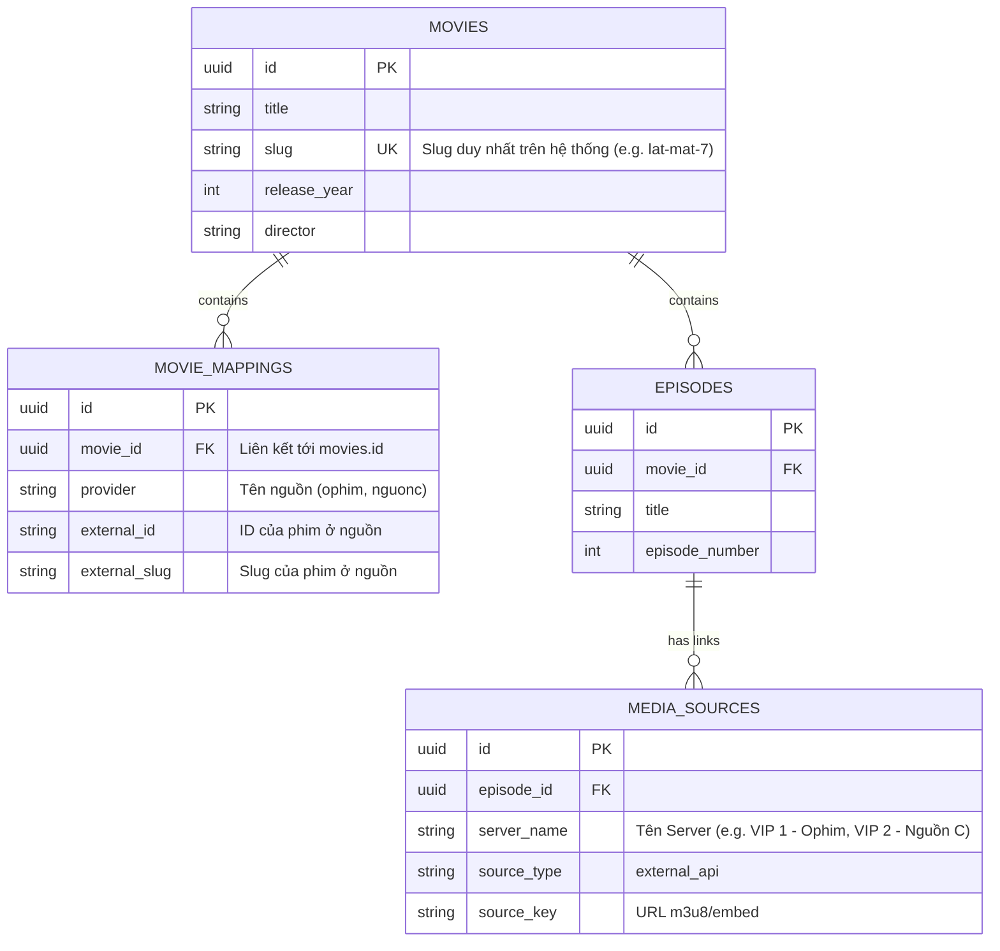
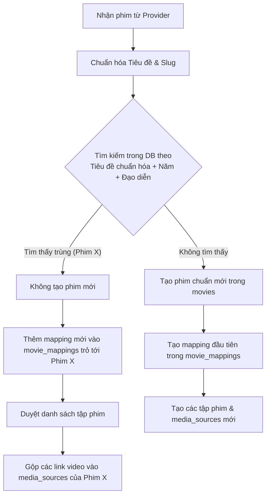

# Thiết kế Kiến trúc Đa nguồn & Gộp phim (Multi-Provider & Movie Merging)

Tài liệu này mô tả chi tiết thiết kế hệ thống hỗ trợ nhiều nguồn phim (Ophim, Nguồn C...) và cơ chế gộp phim (tự động + thủ công) để tối ưu hóa trải nghiệm người dùng (1 phim chuẩn - nhiều server phát).

---

## 1. Kiến trúc Tổng quan (Architecture Overview)

Khi tích hợp thêm nhiều nguồn phim ngoài, ta thường gặp tình trạng phim trùng lặp (ví dụ: cùng phim *Lật Mặt 7* nhưng nguồn Ophim có slug `lat-mat-7`, nguồn Nguồn C có slug `lat-mat-7-nguonc`).

Hệ thống sẽ chuyển dịch sang mô hình **Canonical Movie (Phim chuẩn)**:
* **Bảng `movies`**: Chỉ chứa duy nhất 1 bản ghi phim làm chuẩn hiển thị trên UI.
* **Bảng `movie_mappings`**: Lưu liên kết giữa phim chuẩn với ID/Slug của từng nguồn ngoài.
* **Bảng `media_sources`**: Tập trung tất cả link video của các nguồn khác nhau vào từng tập phim tương ứng của phim chuẩn.



---

## 2. Thay đổi Cơ sở dữ liệu (Database Changes)

### 2.1 SQL Migration
Tạo bảng `movie_mappings` để quản lý liên kết nguồn:

```sql
CREATE TABLE movie_mappings (
    id UUID PRIMARY KEY DEFAULT uuid_generate_v4(),
    movie_id UUID NOT NULL REFERENCES movies(id) ON DELETE CASCADE,
    provider VARCHAR(50) NOT NULL,
    external_id VARCHAR(255) NOT NULL,
    external_slug VARCHAR(255) NOT NULL,
    created_at TIMESTAMP WITH TIME ZONE DEFAULT CURRENT_TIMESTAMP,
    updated_at TIMESTAMP WITH TIME ZONE DEFAULT CURRENT_TIMESTAMP
);

-- Ràng buộc duy nhất: Mỗi phim của một provider chỉ được map tới một phim chuẩn duy nhất
CREATE UNIQUE INDEX idx_provider_external_id ON movie_mappings(provider, external_id);
```

### 2.2 Định nghĩa Go Model (`internal/models/movie_mapping.go`)
```go
package models

import (
	"time"
	"github.com/google/uuid"
	"gorm.io/gorm"
)

type MovieMapping struct {
	ID           uuid.UUID `gorm:"type:uuid;default:uuid_generate_v4();primaryKey" json:"id"`
	MovieID      uuid.UUID `gorm:"type:uuid;not null;index" json:"movie_id"`
	Provider     string    `gorm:"type:varchar(50);not null;uniqueIndex:idx_provider_external" json:"provider"`
	ExternalID   string    `gorm:"type:varchar(255);not null;uniqueIndex:idx_provider_external" json:"external_id"`
	ExternalSlug string    `gorm:"type:varchar(255);not null" json:"external_slug"`
	CreatedAt    time.Time `json:"created_at"`
	UpdatedAt    time.Time `json:"updated_at"`
}

func (MovieMapping) TableName() string { return "movie_mappings" }

func (m *MovieMapping) BeforeCreate(tx *gorm.DB) error {
	if m.ID == uuid.Nil {
		m.ID = uuid.New()
	}
	return nil
}
```

---

## 3. Cơ chế So khớp Tự động (Auto-Matching Flow)

Khi một crawler/sync job phát hiện phim mới từ một nguồn bất kỳ, luồng so khớp tự động sẽ chạy:



### Thuật toán chuẩn hóa so khớp (Normalize Function)
```go
import (
	"regexp"
	"strings"
)

func NormalizeTitle(title string) string {
	title = strings.ToLower(title)
	// Loại bỏ dấu tiếng Việt
	title = RemoveVietnameseAccents(title)
	// Loại bỏ ký tự đặc biệt, giữ lại chữ và số
	reg := regexp.MustCompile(`[^a-z0-9\s]`)
	title = reg.ReplaceAllString(title, "")
	// Loại bỏ khoảng trắng thừa
	title = strings.Join(strings.Fields(title), " ")
	return title
}
```

---

## 4. Cơ chế Gộp Thủ công cho Admin (Manual Merge Flow)

Trong trường hợp tên phim viết sai lệch nhiều khiến auto-match không hoạt động, Admin có thể gộp thủ công từ trang quản trị:

1. **Hành động**: Admin chọn **Phim A (Gốc/Chuẩn)** và **Phim B (Phụ/Bị gộp)** và ấn **Gộp phim**.
2. **Quy trình xử lý tại Backend**:
   * **B1 (Cập nhật mapping)**: Chuyển toàn bộ các bản ghi `movie_mappings` đang trỏ tới Phim B sang Phim A.
   * **B2 (Tạo mapping mới)**: Tạo 1 bản ghi mapping cho nguồn của Phim B trỏ về Phim A (nếu chưa có).
   * **B3 (Gộp tập & nguồn phát)**:
     * Duyệt qua từng tập (`episode`) của Phim B.
     * Tìm tập có số tập tương ứng (`episode_number`) ở Phim A.
     * Đổi `episode_id` của các dòng trong bảng `media_sources` từ tập của Phim B sang tập tương ứng của Phim A.
   * **B4 (Dọn dẹp)**: Xóa Phim B khỏi bảng `movies` (hệ thống sẽ tự động Cascade xóa các tập phim cũ của Phim B).

### Code Minh Họa Hàm Gộp Phim (`internal/repository/movie_repo.go`)
```go
func (r *movieRepo) MergeMovies(ctx context.Context, targetMovieID uuid.UUID, sourceMovieID uuid.UUID, sourceProvider string, sourceExtID string, sourceExtSlug string) error {
	return r.db.WithContext(ctx).Transaction(func(tx *gorm.DB) error {
		// 1. Chuyển mapping của phim phụ sang phim chuẩn
		if err := tx.Model(&models.MovieMapping{}).
			Where("movie_id = ?", sourceMovieID).
			Update("movie_id", targetMovieID).Error; err != nil {
			return err
		}

		// 2. Tạo mapping mới cho nguồn vừa gộp (nếu chưa tồn tại)
		var exists bool
		tx.Model(&models.MovieMapping{}).
			Select("count(1) > 0").
			Where("movie_id = ? AND provider = ?", targetMovieID, sourceProvider).
			Find(&exists)

		if !exists {
			newMapping := models.MovieMapping{
				MovieID:      targetMovieID,
				Provider:     sourceProvider,
				ExternalID:   sourceExtID,
				ExternalSlug: sourceExtSlug,
			}
			if err := tx.Create(&newMapping).Error; err != nil {
				return err
			}
		}

		// 3. Gộp media sources của các tập phim
		var sourceEpisodes []models.Episode
		if err := tx.Where("movie_id = ?", sourceMovieID).Find(&sourceEpisodes).Error; err != nil {
			return err
		}

		for _, sourceEp := range sourceEpisodes {
			var targetEp models.Episode
			// Tìm tập tương ứng ở phim chính bằng episode_number
			err := tx.Where("movie_id = ? AND episode_number = ?", targetMovieID, sourceEp.EpisodeNumber).First(&targetEp).Error
			if err == nil {
				// Nếu tìm thấy tập tương ứng, chuyển media sources sang tập này
				if err := tx.Model(&models.MediaSource{}).
					Where("episode_id = ?", sourceEp.ID).
					Update("episode_id", targetEp.ID).Error; err != nil {
					return err
				}
			}
		}

		// 4. Xóa phim phụ (cascade sẽ xóa episodes cũ của phim phụ)
		if err := tx.Delete(&models.Movie{}, sourceMovieID).Error; err != nil {
			return err
		}

		return nil
	})
}
```

---

## 5. Cập nhật Luồng Phát Phim (Streaming Link Fallback)

Hiện tại, API streaming lấy link trực tiếp từ DB hoặc gọi provider qua `ExternalID` đơn lẻ.
Khi chuyển sang hệ thống đa nguồn, luồng lấy link xem phim sẽ nâng cấp như sau:

1. Khi gọi API `/api/v1/movies/:slug/watch?episode=:episode_slug`
2. Lấy thông tin phim chuẩn theo `slug`.
3. Kiểm tra xem tập phim tương ứng đã có link lưu sẵn trong `media_sources` chưa.
4. Nếu chưa có link (Lazy Import), lấy danh sách mapping của phim đó trong `movie_mappings`.
5. Sử dụng **`Provider Manager`** duyệt qua từng mapping:
   * Gửi yêu cầu lấy link tới API nguồn ngoài (Ophim, Nguồn C) bằng `ExternalID` và `ExternalSlug` của từng mapping theo thứ tự ưu tiên (`Priority`).
   * Trả về link video đầu tiên thành công và lưu tạm (Cache) hoặc lưu vào DB để người dùng sau xem nhanh hơn.
